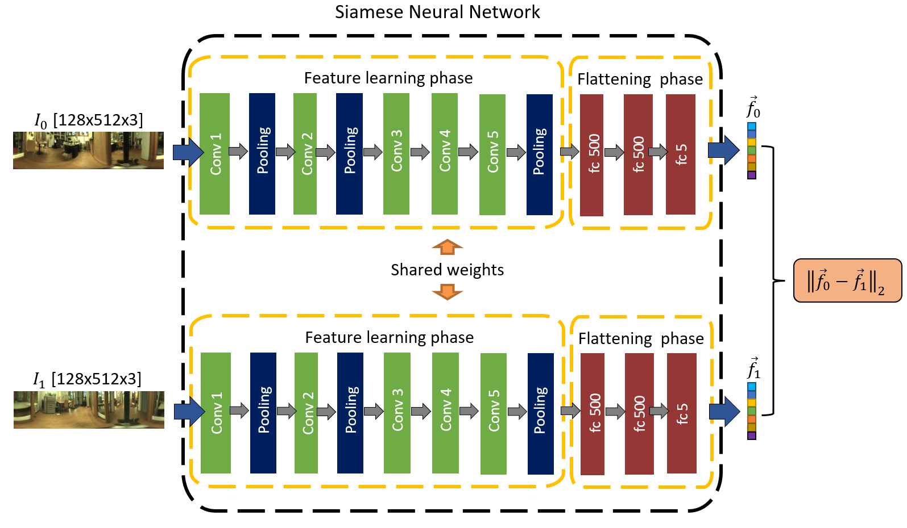

# An Experimental Evaluation of Siamese Neural Networks for Robot Localization Using Omnidirectional Imaging in Indoor Environments

**Authors:** Juan José Cabrera, Vicente Román, Arturo Gil, Oscar Reinoso, Luis Payá  
**Journal:** Artificial Intelligence Review (2024) - Vol. 57, num. 198  
**Publisher:** Springer  
**ISSN:** 1573-7462  
**DOI:** [10.1007/s10462-024-10840-0](https://link.springer.com/article/10.1007/s10462-024-10840-0)
**ArXiv:** [2407.10536](https://arxiv.org/abs/2407.10536)
**YouTube:** [link](https://www.youtube.com/watch?v=UaK0BJ_e06A)

## Introduction

The objective of this paper is to address the localization problem using omnidirectional images captured by a catadioptric vision system mounted on the robot. For this purpose, we explore the potential of Siamese Neural Networks for modeling indoor environments using panoramic images as the unique source of information. Siamese Neural Networks are characterized by their ability to generate a similarity function between two input data, in this case, between two panoramic images. In this study, Siamese Neural Networks composed of two Convolutional Neural Networks (CNNs) are used. The output of each CNN is a descriptor which is used to characterize each image. The dissimilarity of the images is computed by measuring the distance between these descriptors. This fact makes Siamese Neural Networks particularly suitable to perform image retrieval tasks. First, we evaluate an initial task strongly related to localization that consists in detecting whether two images have been captured in the same or in different rooms. Next, we assess Siamese Neural Networks in the context of a global localization problem. The results outperform previous techniques for solving the localization task using the COLD-Freiburg dataset, in a variety of lighting conditions, specially when using images captured in cloudy and night conditions.

## Comparison with other methods

| Global-Appearance Descriptor Technique | Cloudy Error | Night Error | Sunny Error |
|----------------------------------------|--------------|-------------|-------------|
| Alexnet [Cebollada et al., 2022]       | 0.051 m      | 0.288 m     | 0.389 m     |
| EfficientNet [Rostkowska et al., 2023] | 0.240 m      | 0.330 m     | 0.337 m     |
| Siamese Network (ours)                 | 0.148 m      | 0.455 m     | 0.651 m     |
| Siamese Network + DA (ours)            | 0.033 m      | 0.257 m     | 0.991 m     |
| HOG [Cebollada et al., 2022]           | 0.163 m      | 0.451 m     | 0.820 m     |
| gist [Cebollada et al., 2022]          | 0.052 m      | 1.065 m     | 0.884 m     |

Cebollada, S., L. Payá, X. Jiang, and O. Reinoso. 2022. Development and
use of a convolutional neural network for hierarchical appearance-based
localization. Artificial Intelligence Review 55 (4): 2847–2874 

Rostkowska, M. and P. Skrzypczy´nski. 2023. Optimizing appearance-based
localization with catadioptric cameras: Small-footprint models for real-time
inference on edge devices. Sensors 23 (14): 6485 

## Citation
If you find this work useful, please consider citing:

    @article{Cabrera2024SNNLocalization,
      title={An experimental evaluation of Siamese Neural Networks for robot localization using omnidirectional imaging in indoor environments},
      author={Juan José Cabrera and Vicente Román and Arturo Gil and Oscar Reinoso and Luis Payá},
      journal={Artificial Intelligence Review},
      volume={57},
      number={198},
      year={2024},
      publisher={Springer Nature},
      issn={1573-7462},
      doi={10.1007/s10462-024-10840-0}
    }

## Getting Started

### Prerequisites

Ensure you have the following installed:
- Python 3.8+
- Torch
- NumPy
- Matplotlib

You can install the required packages using:

    pip install -r requirements.txt

## Usage

### Dataset

This project uses the [COsy Localization Database (Freiburg)](https://www.cas.kth.se/COLD/cold-freiburg.html), which has been divided into training, validation, and test sets. Six data augmentation effects are individually applied to the training set. The dataset used in this research can be downloaded from: https://drive.google.com/drive/folders/1izX9LsE9f34q3cq2UbUEcneBxfFwPKh9?usp=sharing

### Configuration:
Adjust the dataset path (dataset_folder) and the training parameters in config/parameters.yaml as needed.
    
    dataset_folder: '/home/arvc/Juanjo/Datasets/SiameseFriburgo/'

### Training and test:
Run the training script:

    python3 run_train_and_test.py

